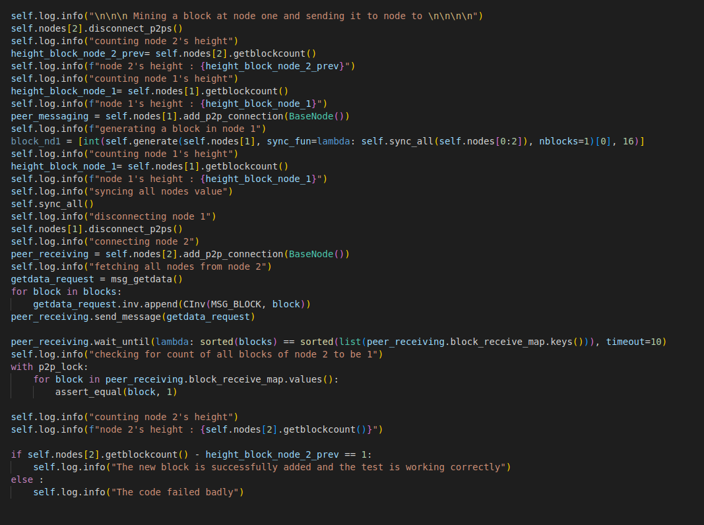

# Bitbuild des femmes 2022

## File contents
#

<b>1. Output.txt -</b> contains the output of the file after running the given assignment 
<b>2. example_test.py -</b> contains the modified example_test.py code for the given assignment 
<b>3. make1.txt -</b> contains the output after running the &nbsp;<code>make</code>&nbsp;command  
<b>4. makeinstall1.txt -</b> contains the output after running the &nbsp; <code>make install</code> &nbsp; command 
<b>5. build1.txt -</b> contains the output after running the <code>&nbsp;$./autogen&nbsp;</code> and <code>&nbsp;./configure &nbsp;</code> command 

## Image for the code snippet
#

